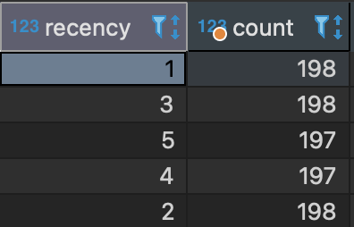
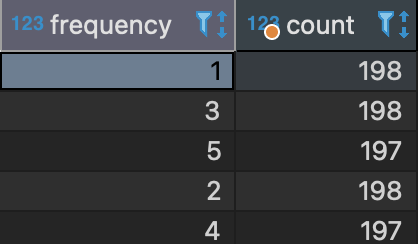

# Витрина RFM

## 1.1. Выясните требования к целевой витрине.

Постановка задачи выглядит достаточно абстрактно - постройте витрину. Первым делом вам необходимо выяснить у заказчика детали. Запросите недостающую информацию у заказчика в чате.

Зафиксируйте выясненные требования. Составьте документацию готовящейся витрины на основе заданных вами вопросов, добавив все необходимые детали.

-----------

### Ответ:
**Цель**: Составить витрину для RFM-классификации пользователей приложения по доставке еды. 
RFM (Recency Frequency Monetary Value) - способ сегментации клиентов по лояльности
в виде того, как часто пользователь покупает (Frequency), на какие суммы (Monetary Value) и недавность последней покупки (Recency).

**Зачем**: На основе полученной сегментации выбирают клиентские категории, на которые стоит направить маркетинговые усилия.

**Глубина данных**: С начала 2021 года.

**Кому доступна витрина**: Она будет расположена в схеме `analysis` с именем `dm_rfm_segments`, поэтому
доступна всем, кто имеет туда доступ. (Нужно уточнить кто будет ею пользоваться, чтобы открыть права лишь на чтение)

**Обновление данных**: не требуется.

**Необходимая структура**: 
- `user_id` - уникальный идентификатор пользователя,
- `recency` - число от 1 до 5, показывающее насколько недавно пользователь совершил покупку. Где 1 - очень давно или никогда, а 5 - совсем недавно.
- `frequency` - число от 1 до 5, показывающее насколько часто пользователь совершает покупки. Где 1 - мало, а 5 - много.
- `monetary_value` - число от 1 до 5, показывающее как много пользователь потратил денег. Где 1 - мало, а 5 - много.
-----------

## 1.2. Изучите структуру исходных данных.

Полключитесь к базе данных и изучите структуру таблиц.

Если появились вопросы по устройству источника, задайте их в чате.

Зафиксируйте, какие поля вы будете использовать для расчета витрины.

-----------

### Ответ:
Все необходимые поля находятся в таблице `orders`:

- `user_id` INT4 (будет использоваться как ключ в *GROUP BY*)
- `order_ts` TIMESTAMP (будет использован для определения даты самого недавнего заказа)
- `payment` NUMERIC(19,5) (будет использован для подсчета суммарных затрат пользователя; тут в принципе можно было бы также использовать `cost` так как эти значения всегда равны тем что в `payment` из-за того что `discount` в таблице `orderitems` везде 0) 

-----------


## 1.3. Проанализируйте качество данных

Изучите качество входных данных. Опишите, насколько качественные данные хранятся в источнике. Так же укажите, какие инструменты обеспечения качества данных были использованы в таблицах в схеме production.

-----------
### Ответ:
Таблица `products`:
```
CREATE TABLE production.products (
    id int4 NOT NULL,
    "name" varchar(2048) NOT NULL,
    price numeric(19, 5) NOT NULL DEFAULT 0,
    CONSTRAINT products_pkey PRIMARY KEY (id),
    CONSTRAINT products_price_check CHECK ((price >= (0)::numeric))
);
```
Столбец `id` является PK, поэтому значения здесь уникальные и не могут быть NULL.
`name` - имя продукта не может быть NULL.
`price` - цена продукты не может быть NULL а также отрицательным значением. Также имеет 0 как значение по умолчанию.

Таблица `orderitems`:
```
CREATE TABLE production.orderitems (
	id int4 NOT NULL GENERATED ALWAYS AS IDENTITY,
	product_id int4 NOT NULL,
	order_id int4 NOT NULL,
	"name" varchar(2048) NOT NULL,
	price numeric(19, 5) NOT NULL DEFAULT 0,
	discount numeric(19, 5) NOT NULL DEFAULT 0,
	quantity int4 NOT NULL,
	CONSTRAINT orderitems_check CHECK (((discount >= (0)::numeric) AND (discount <= price))),
	CONSTRAINT orderitems_order_id_product_id_key UNIQUE (order_id, product_id),
	CONSTRAINT orderitems_pkey PRIMARY KEY (id),
	CONSTRAINT orderitems_price_check CHECK ((price >= (0)::numeric)),
	CONSTRAINT orderitems_quantity_check CHECK ((quantity > 0))
);
```
- `id` - PRIMARY KEY (UNIQUE and NOT NULL)
- `product_id` - уникальный идентификатор продукта. Изначально наложено лишь ограничение NOT NULL, но можно было бы добавить и FOREIGN KEY с ссылкой на `products.id`.
- `order_id` - уникальный идентификатор заказа. Практически всегда встрчается несколько записей по каждому заказу - это потому что таблица хранит данные на уровне продуктов в заказе, который естесственно может быть несколько. Также имеет проверку на NOT NULL и вместе с product_id составляют UNIQUE комбинацию.
- `name` - имя продукта (NOT NULL)
- `price` - цена продукта: NOT NULL, не может быть меньше 0 и имеет значение по умолчанию 0.
- `discount` - скидка: повторяет те же проверки, что и цена плюс проверка на то что скидка не может быть больше самой цены.
- `quantity` - количество указанного товара в заказе: NOT NULL и не может быть меньше 0.

Таблица `orders`:
```
CREATE TABLE production.orders (
	order_id int4 NOT NULL,
	order_ts timestamp NOT NULL,
	user_id int4 NOT NULL,
	bonus_payment numeric(19, 5) NOT NULL DEFAULT 0,
	payment numeric(19, 5) NOT NULL DEFAULT 0,
	"cost" numeric(19, 5) NOT NULL DEFAULT 0,
	bonus_grant numeric(19, 5) NOT NULL DEFAULT 0,
	status int4 NOT NULL,
	CONSTRAINT orders_check CHECK ((cost = (payment + bonus_payment))),
	CONSTRAINT orders_pkey PRIMARY KEY (order_id)
);
```

- `order_id` - уникальный идентификатор заказа. Здесь является PRIMARY KEY так как есть лишь 1 запись по каждому заказу.
- `order_ts` - время совершения заказа: NOT NULL
- `user_id` - уникальный идентификатор пользователя. Имее лишь ограничение NOT NULL, но можно было бы наложить еще и FOREIGN KEY на `users.id`.
- `bonus_payment` - общая скидка по всему заказу. Скорей всего высчитывается через суммирование всемх значений discount в заказе.
- `payment` - сколько клиент заплатил в действительности.
- `cost` - актуальная стоимость заказа. Всегда равна тому сколько клиент заплатил + скидка.
- `bonus_grant` - количество бонусов, которые клиент получил от заказа. Могут использоваться при повторном заказе, чтобы получить скидку?
- `status` - финальный статус заказа (либо Closed либо Cancelled). Имеет лишь ограничение NOT NULL, но можно было бы сделать и FOREIGN KEY с `orderstatuses.id`

Таблица `orderstatuses`:

```
CREATE TABLE production.orderstatuses (
	id int4 NOT NULL,
	"key" varchar(255) NOT NULL,
	CONSTRAINT orderstatuses_pkey PRIMARY KEY (id)
);
```

Хранит информацию о всех возможных статусах заказ может иметь и их соответствующие идентификаторы.
Из проверок - лишь NOT NULL and PRIMARY KEY для идентификатора.

Таблица `users`:

```
CREATE TABLE production.users (
	id int4 NOT NULL,
	"name" varchar(2048) NULL,
	login varchar(2048) NOT NULL,
	CONSTRAINT users_pkey PRIMARY KEY (id)
);
```

Хранит информацию о всех клиентах (имя, логин и id). Првоерки на NOT NULL и PRIMARY KEY(id).

Taблица `orderstatuslog`:

```
CREATE TABLE production.orderstatuslog (
	id int4 NOT NULL GENERATED ALWAYS AS IDENTITY,
	order_id int4 NOT NULL,
	status_id int4 NOT NULL,
	dttm timestamp NOT NULL,
	CONSTRAINT orderstatuslog_order_id_status_id_key UNIQUE (order_id, status_id),
	CONSTRAINT orderstatuslog_pkey PRIMARY KEY (id)
);


-- production.orderstatuslog foreign keys

ALTER TABLE production.orderstatuslog ADD CONSTRAINT orderstatuslog_order_id_fkey FOREIGN KEY (order_id) REFERENCES production.orders(order_id);
ALTER TABLE production.orderstatuslog ADD CONSTRAINT orderstatuslog_status_id_fkey FOREIGN KEY (status_id) REFERENCES production.orderstatuses(id);
```

Хранит информацию о том через какие статусы и когда каждый заказ проходит. Все поля имеют проверки на NOT NULL и комбинация order_id - status является всегде UNIQUE.
Также здесь присутствуют FOREIGN KEY на orders.order_id и orderstatuses.id

**Проверки качества**:
1. NULL значений быть нигде не должно так как в DDL каждой таблицы стоит данная проверка.
2. Количество заказов и количество уникальных заказов в таблице `orders` равно.
```
select count(order_id) = count(distinct order_id) from orders
```
3. `orders.cost` равняется `SUM(orderitems.price * orderitems.quantity)`.
4. `orders.status` хранит лишь 4 и 5 (Closed/Cancelled). В этой таблице как я понял должны храниться данные лишь о звершенных заказах.
```
select distinct status from orders
```
5. `orders.user_id` хранит лишь тех пользователей, который присутствуют в `users.id`.
```
select 
	count(*)
from orders
where user_id not in (select id from users)
```
-----------


## 1.4. Подготовьте витрину данных

Теперь, когда требования понятны, а исходные данные изучены, можно приступить к реализации.

### 1.4.1. Сделайте VIEW для таблиц из базы production.**

Вас просят при расчете витрины обращаться только к объектам из схемы analysis. Чтобы не дублировать данные (данные находятся в этой же базе), вы решаете сделать view. Таким образом, View будут находиться в схеме analysis и вычитывать данные из схемы production. 

Напишите SQL-запросы для создания пяти VIEW (по одному на каждую таблицу) и выполните их. Для проверки предоставьте код создания VIEW.

```SQL
--Впишите сюда ваш ответ
create view analysis.users AS
	select * from production.users;

create view analysis.products AS
	select * from production.products;
	
create view analysis.orderstatuses AS
	select * from production.orderstatuses;
	
create view analysis.orders AS
	select * from production.orders;
	
create view analysis.orderitems AS
	select * from production.orderitems;
	
create view analysis.orderstatuslog AS
	select * from production.orderstatuslog;
```

### 1.4.2. Напишите DDL-запрос для создания витрины.**

Далее вам необходимо создать витрину. Напишите CREATE TABLE запрос и выполните его на предоставленной базе данных в схеме analysis.

```SQL
--Впишите сюда ваш ответ
CREATE TABLE analysis.dm_rfm_segments (
	user_id int4 NOT NULL,
	recency int2 NOT NULL,
	frequency int2 NOT NULL,
	monetary_value int2 NOT NULL,	
	CONSTRAINT dm_rfm_segments_recency_check CHECK (((recency >= (1)) AND (recency <= 5))),
	CONSTRAINT dm_rfm_segments_frequence_check CHECK (((frequency >= (1)) AND (frequency <= 5))),
	CONSTRAINT dm_rfm_segments_monetary_value_check CHECK (((monetary_value >= (1)) AND (monetary_value <= 5))),
	CONSTRAINT users_pkey PRIMARY KEY (user_id)
);


-- analysis.dm_rfm_segments foreign keys

ALTER TABLE analysis.dm_rfm_segments ADD CONSTRAINT dm_rfm_segments_user_id_fkey FOREIGN KEY (user_id) REFERENCES production.users(id);
```

### 1.4.3. Напишите SQL запрос для заполнения витрины

Наконец, реализуйте расчет витрины на языке SQL и заполните таблицу, созданную в предыдущем пункте.

Для решения предоставьте код запроса.

```SQL
--Впишите сюда ваш ответ

with user_stats as ( 

		select 	 

			user_id, 

			MAX(order_ts) as most_recent_order, 

			count(order_id) as total_num_orders, 

			sum(payment) as total_revenue 

		from  

			production.orders 

		where status = 4 -- considering only fulfilled orders 

		group by user_id 

)

select 
	*,
	NTILE(5) OVER(order by most_recent_order desc) as recency,
	NTILE(5) OVER(order by total_num_orders desc) as frequency,
	NTILE(5) OVER(order by total_revenue desc) as monetary_value
from 
	user_stats;


```

Заметка о качестве распределения:

Благодаря оконной функции NTILE мы смогли получить равномерное распределение для всех 3х признаков (Recency, Frequency, Monetary Value)






