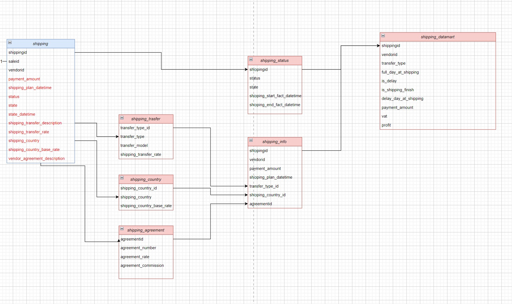

# Проект 2 спринта

## Описание:
Заказ в интернет-магазине — это набор купленных товаров и их количество. Покупатели привыкли получать заказы одномоментно, поэтому каждый заказ из набора товаров формируется в одну сущность доставки.

Интернет-магазину важно видеть, что сроки доставки соблюдаются, а её стоимость соответствует тарифам. Он платит за доставку самостоятельно, и стоимость доставки меняется в зависимости от страны — это базовая сумма, которую учитывает вендор. По договору он дополнительно получает прибыль за счёт комиссии от вендора.

Но сейчас эти данные хранятся в одной таблице, `shipping`, где много дублирующейся и несистематизированной справочной информации. По сути там содержится весь лог доставки от момента оформления до выдачи заказа покупателю.

**Дано**: 
- Таблица `public.shipping`, определение которой можно найти [здесь](./scripts/init.sql).

**Цель**:
- Сделать миграцию в отдельные логические таблицы, а затем собрать на них витрину данных.
  
**Зачем**:
- Это поможет оптимизировать нагрузку на хранилище и позволит аналитикам, перед которыми стоит задача построить анализ эффективности и прибыльности бизнеса, отвечать на точечные вопросы о тарифах вендоров, стоимости доставки в разные страны, количестве доставленных заказов за последнюю неделю. 
  Если искать эти данные в таблице исходных логов доставки, нагрузка на хранилище будет не оптимальна. Придется усложнять запросы, что может привести к ошибкам.
  
  
### Конечный вид модели данных:

